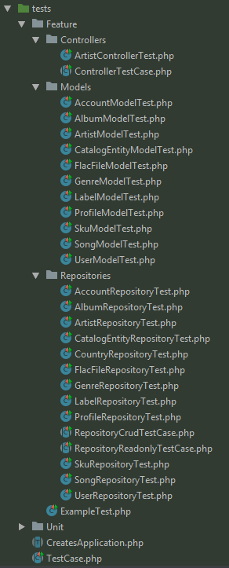

# Testing
At **IndieHD** we test all of our implementations. There are different types of tests depending on 
the repository you are working with and depending on the type of test you are performing 
(Unit/Feature). 

**Contributors**
If you plan on contributing, you will be expected
to provide tests for your implementations also. All tests must pass before any PR's are even
considered!

In this documentation we will try and explain how we specifically handle our tests and what would be
expected of you as a contributor.

#### Directory Structure (`web-api`)
 
 The below image should give you a good idea how our tests are organized. Mostly you see Feature 
 tests here!
 
 
 
 #### Whats the difference between a `Unit Test` and a `Feature Test` ?
 
 This is the way we like to interpret it:
 
 * ***`Unit Test`*** - testing an individual unit, such as a method (function) in a class, with all 
 dependencies mocked up.
 
 * ***`Feature (aka Functional/Integration) Test`*** - testing a slice of functionality in a system. 
 This will test many methods and may interact with dependencies like Databases or Web Services.
 
 #### Example of a ***`Feature Test`***
 
 `Phpunit` (web-api)
 ```php
/**
* Ensure the method create() creates a new record in the database and creates a profile for
* said Artist.
*
* @return void
*/
public function test_method_create_storesNewModel()
{
    $profile = factory($this->profile->class())->make()->toArray();
    
    $artist = $this->repo->create($profile);
    
    $this->assertInstanceOf($this->repo->class(), $artist);
    $this->assertInstanceOf($this->profile->class(), $artist->profile);
}
 ```
 
 #### Example of a ***`Unit Test`***
 
 `Phpunit` (web-api)
 
 *This is just a crude example and not related to this project. At the time of this writing we do not
  have a example of a Unit test in this project.*
 ```php
 public function testDivideByZero() {
    $calcMock=$this->getMock('\Calculator',array('getNumberFromUserInput'));
    $calcMock->expects($this->never())
        ->method('getNumberFromUserInput')
        ->will($this->returnValue(10));
    $this->assertEquals(NAN, $calcMock->divideBy(0));
}
 ```
 
 `Jest` (website-ui)
```javascript
describe('Home.vue', () => {
  it('should render correct contents', () => {
    const Constructor = Vue.extend(Home);
    const vm = new Constructor().$mount();
    expect(vm.$el.querySelector('.home-view h1').textContent)
    .toEqual('Welcome to IndieHD');
  });
});
```

 
 
 
 