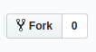

# Web API Documentation
[](https://waffle.io/indiehd/web-api)
[](https://travis-ci.org/indiehd/web-api)

## Repository Duties

* Server side processing
* Database operations
* Notifications
* Automated tasks
* Queues
* Mail (with mail templates)
* Multi-lang support

## Qualifications

* PHP (Specifically [PSR2](https://www.php-fig.org/psr/psr-2/))
* [Laravel Framework](https://laravel.com/docs/5.7)
* Strong understanding of [S.O.L.I.D Principles](https://medium.com/prod-io/solid-principles-takeaways-ec0825a07247)
* Familiarity with [PhpUnit Testing](https://laravel.com/docs/5.7/testing)


## Fork
You would fork [web-api](https://github.com/indiehd/web-api) if you want to contribute to the server side Api. 

Just click the `Fork` button in the top right of the repository page:



Once forked, you will then `clone` ***YOUR*** repository to your local machine.

## Clone via HTTPS

?> Replace `<YOU>` with your username or organization!

```
git clone https://github.com/<YOU>/web-api.git
```

## Clone via SSH

*Requires a [SSH Key](https://help.github.com/articles/generating-a-new-ssh-key-and-adding-it-to-the-ssh-agent/) to be 
added to your github account*

?> Replace `<YOU>` with your username or organization!

```
git clone git@github.com:<YOU>/web-api.git
```

## Help
If you are struggling and nee help, you can come chat with us on [Our Discord](home/COMMUNITY)
